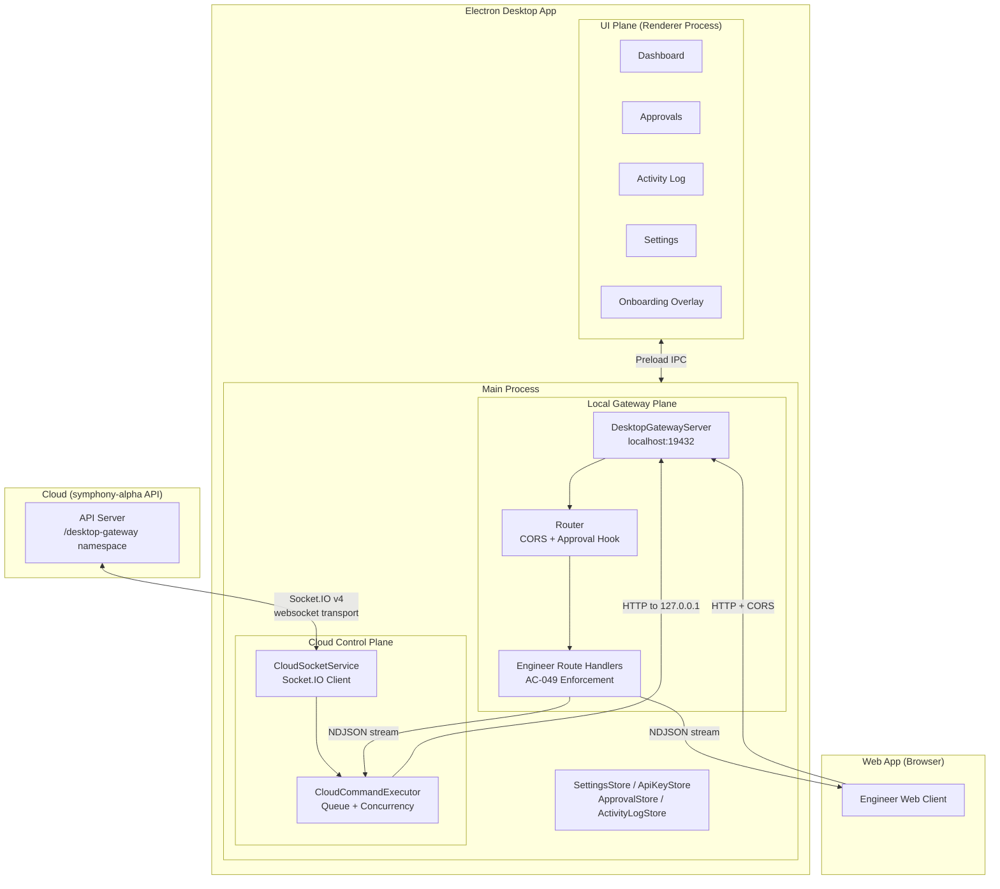
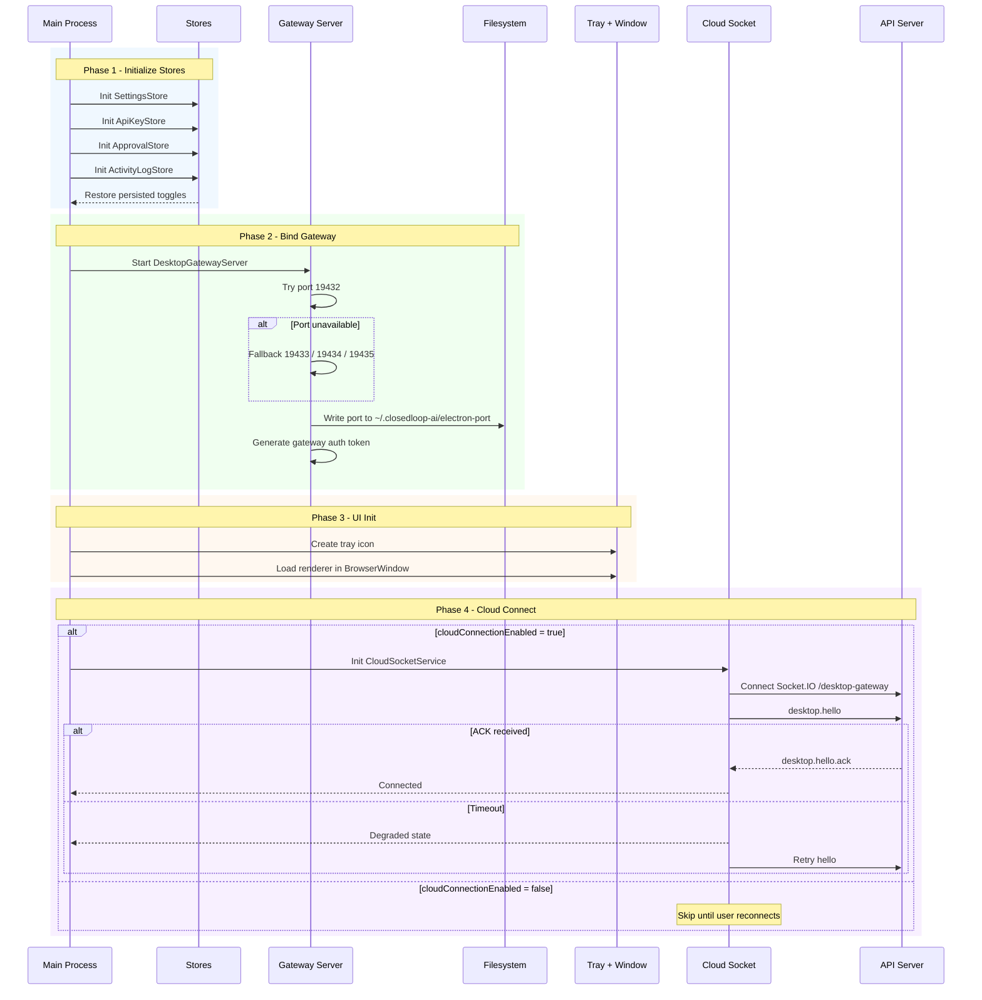
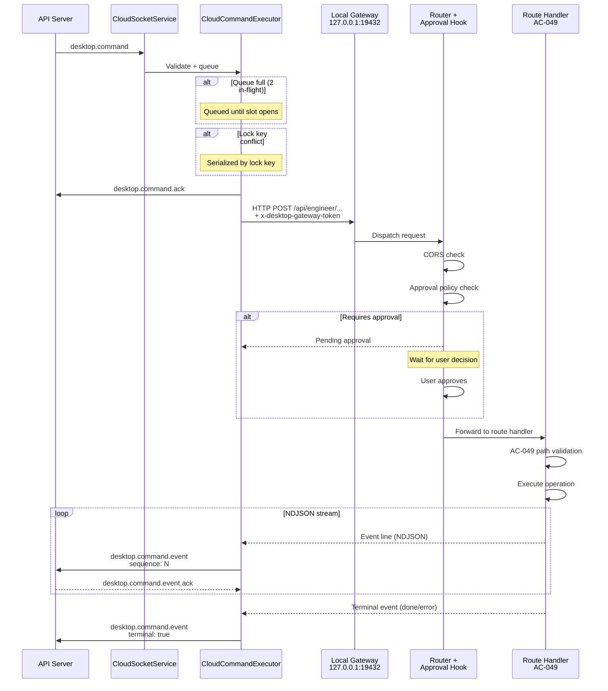
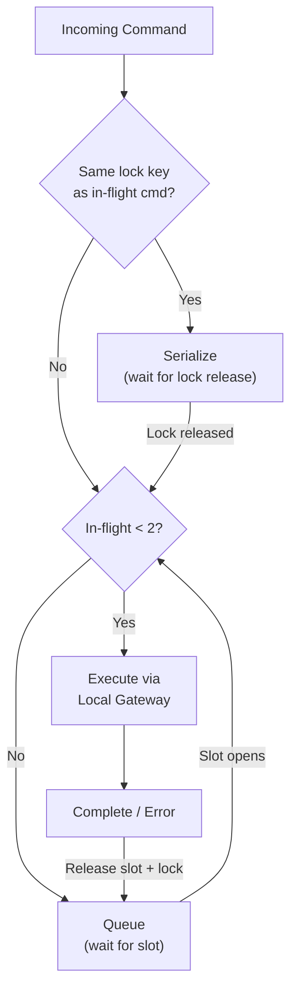
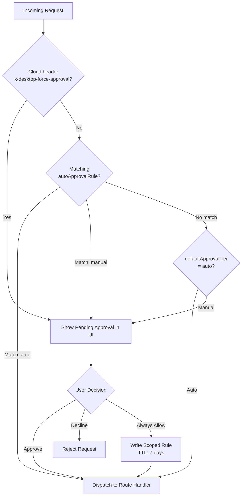
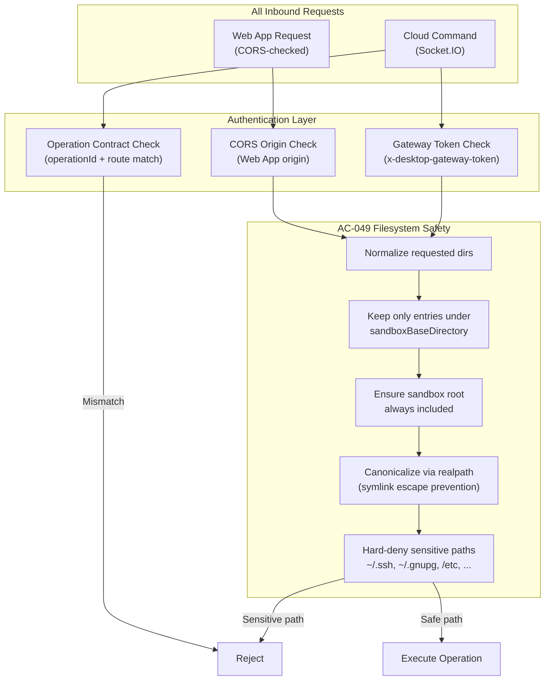
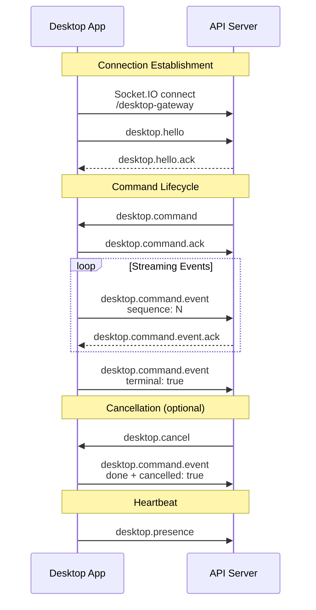

# Closedloop Desktop Electron Architecture

Last updated: 2026-02-27
Repo: `/Users/daniel.ochoa/Source/closedloop-electron`

## Purpose

This document is the single architecture reference for the Electron desktop app.

It covers:

- Runtime architecture inside the Electron app
- Local gateway API behavior (`localhost`)
- Cloud command channel behavior (Socket.IO)
- Security, approvals, persistence, and execution model

It does not describe backend/API implementation details in `symphony-alpha`, except where the desktop app integrates with it.

## High-Level Architecture

The desktop app has three major planes:

1. UI plane (Electron renderer)
- Onboarding overlay, Dashboard, Approvals, Activity Log, Settings
- Uses preload IPC APIs to communicate with main process

2. Local gateway plane (Electron main + embedded HTTP server)
- Serves `GET /health` and all `/api/engineer/*` routes on localhost
- Enforces CORS using configured Web App origin
- Executes tools/processes and streams NDJSON events

3. Cloud control plane (Electron main + Socket.IO client)
- Maintains outbound Socket.IO connection to API namespace `/desktop-gateway`
- Receives command envelopes and executes them through the local gateway
- Streams command progress/results back over the same socket

## Runtime Flow

### Boot Sequence

1. Main process initializes stores and services:
- `SettingsStore`
- `ApiKeyStore`
- `ApprovalStore`
- `ActivityLogStore`
- `DesktopGatewayServer`
- `CloudSocketService`
- `CloudCommandExecutor`
- Restores persisted safety toggles (`cloudCommandsPaused`, `cloudConnectionEnabled`)

2. Desktop gateway server binds localhost port:
- Preferred `19432`, fallback `19433 -> 19434 -> 19435`
- Writes active port to `~/.closedloop-ai/electron-port`
- Generates a process-local gateway auth token used by internal command execution

3. Tray and window initialize:
- Main window loads renderer UI
- Window close hides to tray (app remains running)

4. Cloud socket starts:
- Connects to `{apiOrigin}/desktop-gateway` via Socket.IO v4 with websocket transport
- Auth via API key from secure store/environment
- Sends `desktop.hello` on connect
- If `desktop.hello.ack` is not received within timeout, runtime transitions to degraded and retries hello
- Enforces secure API origin policy (`https` required except loopback `http://localhost`/`127.0.0.1` for local dev)
- If `cloudConnectionEnabled=false`, socket startup is skipped until user reconnects

### Onboarding and Safety Gate

- On first launch (or when `onboardingCompleted=false`), renderer shows an onboarding overlay.
- Required onboarding fields:
1. API origin
2. Web app origin
3. sandbox base directory (native directory picker supported)
4. optional API key (if not already stored)
- Before onboarding is completed, cloud commands are rejected with `onboarding not completed`.
- Completing onboarding sets:
1. `sandboxBaseDirectory`
2. `onboardingCompleted=true`

### Command Execution Sequence (Cloud -> Desktop -> Local Gateway)

1. API sends `desktop.command`.
2. `CloudCommandExecutor` validates and queues command.
3. Executor sends `desktop.command.ack`.
4. Executor dispatches HTTP request to local gateway (`http://127.0.0.1:<activePort>/api/engineer/...`).
5. Local gateway runs existing route handlers with normal AC-049 checks.
6. Executor maps gateway output to socket `desktop.command.event` stream.
7. API acks stream sequence via `desktop.command.event.ack`.
8. Executor supports replay on reconnect from `resumeFromSequence`.

## Key Modules

| Module | Responsibility |
| --- | --- |
| `apps/desktop/src/main/app.ts` | Composition root; boot/shutdown; IPC handlers; approval policy; tray/runtime state |
| `apps/desktop/src/main/cloud-socket.ts` | Socket.IO lifecycle and protocol events (`hello`, command receive, cancel receive, event ack receive) |
| `apps/desktop/src/main/cloud-command-executor.ts` | Queueing, concurrency control, lock-key serialization, cancel/timeout handling, replay buffers |
| `apps/desktop/src/main/cloud-protocol.ts` | Shared protocol/event types for cloud socket channel |
| `apps/desktop/src/server/server.ts` | Local HTTP server binding, fallback ports, discovery-file writing |
| `apps/desktop/src/server/router.ts` | Request dispatch, CORS, approval hook, fallback proxy support |
| `apps/desktop/src/main/approval-store.ts` | Pending-approval queue persistence and decision waiting |
| `apps/desktop/src/main/activity-log-store.ts` | Activity event persistence for renderer |
| `apps/desktop/src/main/settings-store.ts` | API origin, web origin, sandbox dir, approval tier/rules |
| `apps/desktop/src/main/api-key-store.ts` | Secure API key read/write using Electron `safeStorage` |

## Command Scheduling and Concurrency

Current desktop execution policy:

- One socket connection supports many commands.
- Maximum in-flight commands: `2` (hardcoded constant in `app.ts`).
- Commands beyond capacity are queued.
- Conflicting commands are serialized by lock key.
- Lock key resolution order:
1. explicit `command.lockKey`
2. derived from `operationId + scoped path` in command body (`repoPath`, `worktreePath`, `workDir`, `runDir`, `path`)

## Streaming Model

Local gateway streaming remains parser-compatible with existing engineer clients:

- HTTP response with `Content-Type: text/event-stream`
- Newline-delimited JSON payloads (NDJSON-style lines)

Cloud socket event stream:

- `desktop.command.event` with per-command monotonic `sequence`
- Terminal semantics:
1. `done` terminal success
2. `done` with `cancelled=true` terminal cancelled
3. `error` with `terminal=true` terminal failure

## Approvals Model

Approval decisions are evaluated before local route dispatch:

- Default approval tier is from settings (`defaultApprovalTier`)
- Per-operation overrides from `autoApprovalRules`
- `tier=auto` allows request without manual approval
- Cloud command can force approval using headers injected by executor:
1. `x-desktop-force-approval: 1`
2. `x-desktop-approval-reason: ...`
3. `x-desktop-source: cloud-socket`

Pending approvals are persisted and shown in UI with:

- Approve
- Decline
- Always Allow (writes a scoped rule with TTL; default expiry is 7 days)

Scoped Always Allow matching keys:

1. `operationId`
2. HTTP `method`
3. request `path`
4. optional normalized scope path from request body (`repoPath`, `worktreePath`, `workDir`, `runDir`, `path`)

## Security Model

### Filesystem and Process Safety (AC-049)

- Route handlers enforce path allowlists before filesystem/process operations.
- The effective allowlist is derived solely from `sandboxBaseDirectory` via `buildAllowedDirectories()` in `shared/sandbox-policy.ts`, producing a single-entry array `[sandboxBaseDirectory]` or `[]` when unset.
- All command execution still flows through the same route handlers, so cloud-originated commands do not bypass checks.
- Path checks canonicalize via nearest realpath to reduce symlink escape risk.
- Sensitive paths are hard-denied (for example `~/.ssh`, `~/.gnupg`, keychains, and core system dirs like `/etc`).
- Terminal chat CLI execution chooses a working directory from the effective allowed-directory set (sandbox-safe), instead of using home directory by default.

### Origin Separation (AC-052)

- API origin and Web App origin are separately configurable.
- Web App origin is used for CORS allow-origin on local gateway.
- API origin is used for cloud socket connection target.
- Preflight requests with `Access-Control-Request-Private-Network: true` are supported with `Access-Control-Allow-Private-Network: true` for hosted-browser to localhost access.

### API Key Handling

- API key stored with Electron `safeStorage` encryption when available.
- Environment fallback order:
1. `CLOSEDLOOP_API_KEY`
2. `SYMPHONY_API_KEY`

### Local Gateway Authentication

- CORS is not treated as authentication.
- Engineer routes can require a process-local gateway token (`x-desktop-gateway-token`).
- Cloud-dispatched commands include this token automatically when calling local gateway routes.
- Browser requests from trusted origins are allowed on loopback without the gateway token:
1. exact configured `webAppOrigin`
2. localhost origins (for local development), such as `http://localhost:3000`
- Incoming cloud commands are rejected if `operationId` and route path do not map to the same allowed operation contract.

## Persistence

Persistent stores used by desktop app:

- `desktop-settings` (Electron Store)
- `desktop-secrets` (encrypted API key blob)
- `desktop-approvals` (pending approvals)
- `desktop-activity-log` (request activity history)

Notable persisted settings include:

- API and web origins
- sandbox base directory (sole source of the effective allowlist)
- onboarding completion
- cloud command pause toggle
- cloud connect/disconnect toggle

Other persisted operational files are managed by route handlers under `~/.symphony`, `~/.claude`, and worktree-local `.claude/work` paths.

## Tray and UX Behavior

- App is reachable from tray when window is closed.
- Tray displays runtime status and pending approval count.
- Renderer tabs:
1. Dashboard
2. Approvals
3. Activity Log
4. Settings

Dashboard highlights:

- Human-readable runtime cards for:
1. Local Gateway Port
2. Cloud Connection
3. Target ID
4. API Server (`apiOrigin`)
5. Remote Commands state (`Running` / `Paused`)
- WebSocket state badge (`Connected`, `Connecting`, `Disconnected`) plus detail text
- Technical/raw runtime payload is available under a collapsible "Technical details" section
- Header includes:
1. pause/resume toggle for cloud command intake (emergency kill-switch behavior)
2. disconnect/reconnect cloud socket button
- Pause and disconnect toggles persist across app restarts.

Activity Log tab:

- Shows a scrollable list of activity cards (not raw JSON)
- Each card includes request method/path, status code, timestamp, and duration
- Includes event type (`REQUEST` vs `SECURITY`) with filter toggles for each.
- Security events include blocked unauthorized attempts (`401`).

Settings UX notes:

- API origin and web app origin are validated/normalized on save.
- Sandbox base directory is selectable via native folder picker.
- Broad/sensitive sandbox values show warning text (for example `/`, home-root, system directories).

## Current Integration Contract With API

Desktop expects API Socket.IO namespace and event names:

- Outbound:
1. `desktop.hello`
2. `desktop.command.ack`
3. `desktop.command.event`
4. `desktop.presence`

- Inbound:
1. `desktop.hello.ack`
2. `desktop.command`
3. `desktop.cancel`
4. `desktop.command.event.ack`

Desktop-side contract checkpoints: `docs/artifacts/desktop-gateway-contracts.md`
Hosted API handoff details are maintained in `symphony-alpha`.

## Known Gaps and Notes

- API-side durable command/event persistence is currently outside this repo and tracked in `symphony-alpha`.
- Legacy documentation sections describing HTTP register/heartbeat are historical; current desktop runtime uses Socket.IO cloud control path.
- Local gateway route parity and NDJSON behavior remain compatible with existing engineer route expectations.
- Local gateway token auth primarily protects against opportunistic localhost access; endpoint compromise on the host can still read local process memory or user files.
